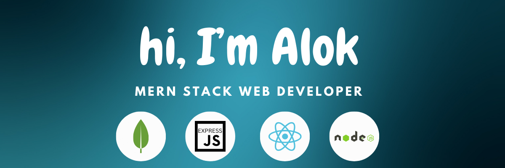

# 💫 About Me:
👨‍💻 I’m Alok Kumar, a professional MERN Stack Web Developer. 🛠️ I specialize in building responsive, scalable, and high-performance web applications using MongoDB, Express.js, React.js, and Node.js. 🎓 I’m currently pursuing a Bachelor of Arts degree from the National University of Bangladesh. 🚀 I quickly adapt to new technologies and continuously improve my skills to stay ahead in the field. 🤝 I'm open to collaborating with organizations or teams where I can contribute and grow. 💡 I have a strong passion for problem-solving and creating user-friendly digital experiences. 🥁 In my free time, I enjoy playing the drums and reading books, both of which help me stay creative, focused, and constantly inspired. 📫 Reach me at: Alok61.bd@gmail.com   

I build modern, responsive, and scalable web applications with a strong focus on clean architecture and smooth user experience.  
I also work with:

- **Next.js** – for server-side rendering and performance  
- **Redux / RTK Query** – for state and data management  
- **Tailwind CSS** – for fast and responsive styling  
- **React Hook Form + Zod** – for form validation  
- **NextAuth.js** – for secure authentication  
- **Express.js + Mongoose** – for backend API development  
- **SSLCommerz** – for integrating secure payment gateways

I'm always eager to learn new technologies and build impactful web solutions.

## 🌐 Socials:
    

# 💻 Tech Stack:
                                 
# 📊 GitHub Stats:
 
 

## 🏆 GitHub Trophies

### 🔝 Top Contributed Repo

---

<!-- Proudly created with GPRM ( https://gprm.itsvg.in ) -->
